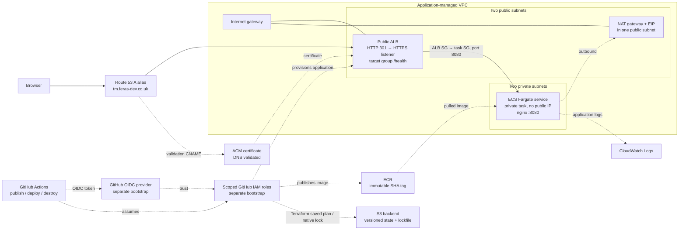

# ECS v1 — IT Tools

## Project overview

This project deploys the existing [IT Tools](https://github.com/CorentinTh/it-tools) Vue/Vite application to AWS ECS Fargate in `eu-west-2` (account `670941257756`). The public endpoint is [https://tm.feras-dev.co.uk](https://tm.feras-dev.co.uk). Nginx serves the built static application as a non-root user on port 8080; `/health` returns JSON `{"status":"ok"}`.

## Architecture diagram

See the [architecture diagram](docs/diagrams/architecture.md). Modular Terraform in `terraform/` creates a custom VPC with two public and two private subnets, an internet gateway, one NAT gateway/EIP, a public Application Load Balancer (ALB), and an ECS Fargate service with private tasks and no public IPs. The ALB security group is the only ingress source for the task security group. Route 53 points `tm.feras-dev.co.uk` to the ALB; Terraform creates and DNS-validates the ACM certificate before creating the HTTPS listener. HTTP redirects to HTTPS. ECR stores immutable source-SHA-tagged images, and CloudWatch receives container logs.

The separately bootstrapped S3 backend stores application state at `ecs-v1/dev/terraform.tfstate` with native S3 locking (`use_lockfile = true`). Its bucket and version history, the existing Route 53 hosted zone, and the separate GitHub OIDC bootstrap state survive application destroy. GitHub Actions assumes scoped AWS roles through OIDC; the workflows use no static AWS access keys. One task and one NAT gateway are configured, so this is not a fully redundant deployment.



## Local setup

The upstream application source is in `app/`. From PowerShell, with Node 20 and Corepack available:

```powershell
cd app
corepack enable
corepack pnpm install --frozen-lockfile
corepack pnpm dev
```

The `dev` script starts Vite. These are reproduction instructions; no dated, contemporaneous pre-Docker local execution capture was found in this repository. The source manifest specifies pnpm 9.11.0. Return to the repository root for the container commands:

```powershell
docker build --platform linux/amd64 -t ecs-it-tools ./app
docker run --rm -p 8080:8080 ecs-it-tools
curl.exe -i http://localhost:8080/health
```

The multi-stage Dockerfile builds with Node/pnpm and runs nginx as `appuser` on port 8080. Repository history introduced the custom deployment Dockerfile in commit `29090f5` and later changed its nginx port in `7ad10e6`; the IT Tools application source is upstream. [Local container evidence](docs/screenshots/local-container-health.png) is historical Docker evidence, not proof of a pre-Docker run.

## Project structure

```text
app/                 Application source, Dockerfile and nginx configuration
terraform/           Application Terraform root and environment inputs
terraform/modules/   VPC, ECR, ALB and ECS modules
.github/workflows/   Publication, deployment, destroy and verification workflows
docs/diagrams/       Architecture source
docs/evidence/        Dated run and runtime records
docs/screenshots/     Browser, pipeline and AWS console captures
README.md            Project overview and reproduction entry point
```

## Deployment and pipelines

The three required root workflows are [application publication](.github/workflows/application.yml), [Terraform deployment](.github/workflows/terraform-deploy.yml), and [Terraform destroy](.github/workflows/terraform-destroy.yml). Publication builds/tests `linux/amd64` from the dispatch commit, pushes to ECR, and records the immutable tag and digest. Deployment supports `ecr-bootstrap`, `certificate-bootstrap`, and full `deploy`; it verifies explicit image identity, stores a versioned saved plan in private S3, checks its SHA256 and scope, then requires the `dev-terraform-apply` approval gate for apply. The full apply checks ECS/ALB runtime, HTTPS `/health`, and a subsequent no-change plan. Destroy uses a separate reviewed delete-only saved plan and the same human approval gate.

To reproduce after an approved clean destroy: verify account/region and retained foundations; bootstrap ECR; publish an image from an explicitly selected full source SHA and record its new digest; bootstrap ACM; review and apply the full deployment plan with that tag and digest; then verify service/target, logs, HTTPS health, HTTP redirect, browser rendering, and no-change plan. Each saved plan needs its own review and approval. See the [deployment runbook](docs/deployment.md) and [destroy runbook](docs/terraform-destroy-workflow.md).

The final M3 deployment uses source/image tag `f91e4e9c942a94f0c37388acd6948366e80afefa` and ECR/task digest `sha256:ccf22a730439f38a4c56912f6b61425ce07cb2a2e49dbd6010e8d3b097b9e1be`. Captured service state was 1 desired, 1 running, 0 pending. The ALB target was Healthy. HTTPS `/health` independently returned HTTP 200 with the expected JSON. ECS task `healthStatus` was **UNKNOWN**, so this is not a claim of container health `HEALTHY`. The M3 deployment run's unmasked post-apply no-change step passed. These are dated observations, not a guarantee of present availability.

The [M4 gate evidence](docs/evidence/m4-health-gate.md) shows the unchanged production script rejecting a runner-local HTTPS 503 fixture in a failed Actions run, followed by a successful live healthy run. It was not an ECS outage or failed deployment.

## Demo and pipeline evidence

The browser capture visibly shows the final HTTPS URL; the linked records give the run and image identities. The green destroy screenshot is a **plan-only** run, not the destructive apply.


| Pipeline evidence | Final screenshot | What it shows |
| --- | --- | --- |
| Application publication | [M3 application pipeline](docs/screenshots/2026-09-26-m3-application-pipeline-success.png) | Image build and publication run |
| Terraform deployment | [M3 deployment pipeline](docs/screenshots/2026-09-26-m3-terraform-deploy-success.png) | Final deployment run |
| Terraform destroy, plan only | [M2 green plan-only run 36268361308](docs/screenshots/2026-09-26-m2-destroy-plan-only-success.png) | Plan job succeeded; apply was skipped |
| M2 cleanup recovery | [Verification-only recovery](docs/screenshots/2026-09-26-m2-destroy-recovery-success.png) | Later read-only cleanup verification |

The later [destructive M2 run 36269051826](https://github.com/Fer-as/ecs-v1-it-tools/actions/runs/36269051826) applied its approved plan and destroyed 33 resources, including NAT/EIP. Its post-destroy verifier then failed on the NAT CLI option; that original workflow run remained failed. The separate [recovery run 36271972985](https://github.com/Fer-as/ecs-v1-it-tools/actions/runs/36271972985) passed. [Other final AWS screenshots](docs/evidence/README.md#final-m2m3-screenshots-present-locally) and the post-M4 independent curl capture are in the evidence index.

## Evidence and limitations

The [final evidence index](docs/evidence/README.md) links M1 restoration, the original M2 destroy and later recovery, M3 recreation/runtime, M4 rejection/recovery, the final screenshots, and the independent post-M4 HTTP capture. The original M2 destroy apply deleted 33 resources, including NAT/EIP, but its post-destroy verifier failed on an AWS CLI option; a later read-only workflow recovered cleanup evidence. The original run remains failed.

ECR scan status was reported as Complete with **17 Critical, 58 High, 41 Medium, and 3 Low** findings. The image is not vulnerability-free and no security pass is claimed. Vulnerability remediation was not established as a mandatory assignment requirement; the findings remain disclosed for follow-up. Independent final submission acceptance and genuine pre-Docker execution proof are not established by the evidence in this repository.
