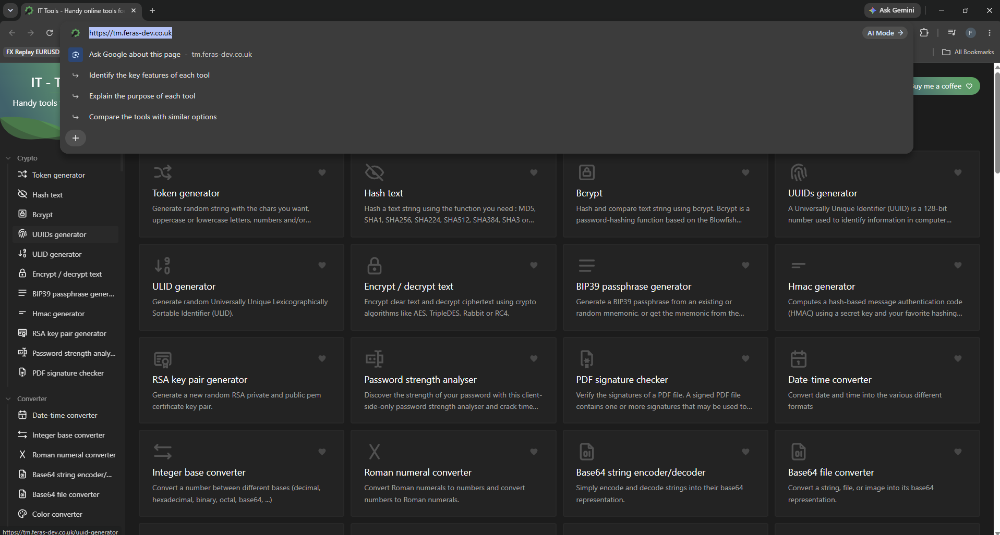
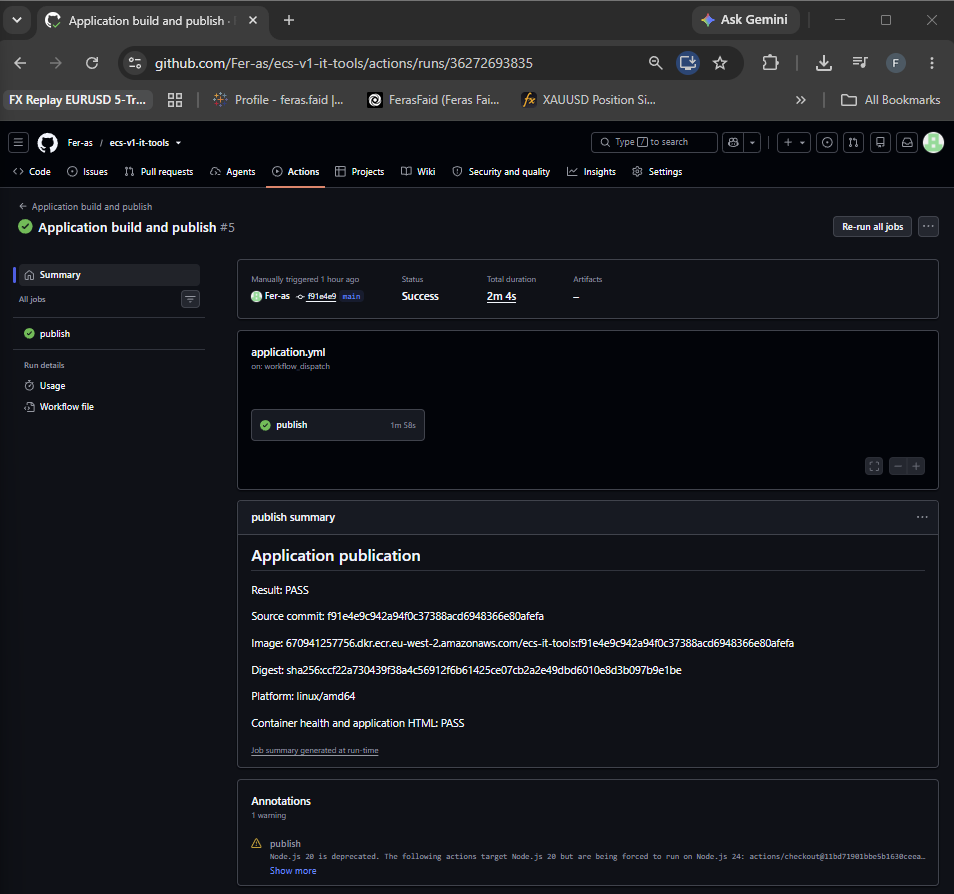
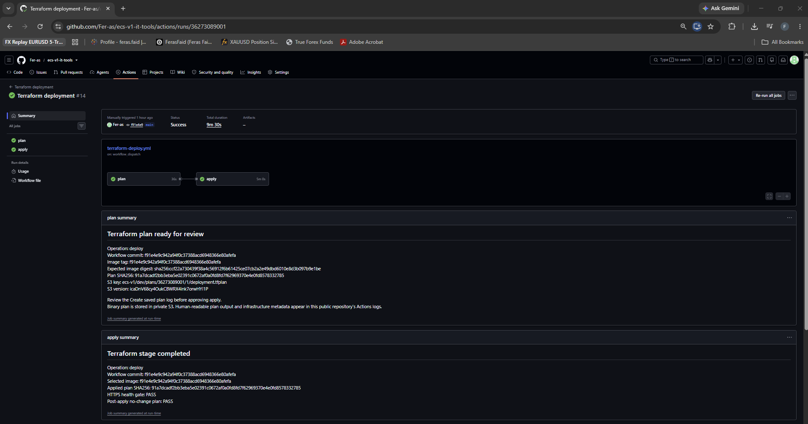

# ECS v1 - IT Tools on AWS

## Project overview

I deployed the open-source [IT Tools](https://github.com/CorentinTh/it-tools) application on AWS ECS Fargate. Docker builds the image, Terraform defines the AWS resources, and GitHub Actions runs the pipelines. The deployment is in `eu-west-2`, in AWS account `670941257756`.

## Live application

Open [https://tm.feras-dev.co.uk](https://tm.feras-dev.co.uk). The screenshot shows the HTTPS address:



Nginx serves the application and returns `{"status":"ok"}` from `/health`. At my final check, the ECS service showed 1 desired task, 1 running and 0 pending. The ALB target was **Healthy**, and HTTPS `/health` returned HTTP 200. ECS reported `healthStatus: UNKNOWN`, so I am not using that field as proof of container health.

The final deployment uses an immutable source-SHA-tagged image from ECR. The exact tag and digest are recorded in the [evidence index](docs/evidence/README.md).

## Why I chose this setup

I chose IT Tools instead of a basic sample page because I wanted a real application to build, open in a browser and test. I also deployed the ECS/ALB/HTTPS path manually during the project to understand how the AWS pieces fit together before relying on the Terraform workflow.

I kept the Fargate task in private subnets without a public IP. The ALB is the public entry point; its security group can reach the task on port 8080. A NAT gateway gives the task outbound access.

I split Terraform into VPC, ALB, ECS and ECR modules to make plans easier to follow. Application resources have their own state and destroy lifecycle. The S3 backend, Route 53 hosted zone and GitHub OIDC bootstrap stay separate.

GitHub Actions uses OIDC to assume AWS roles, so I did not put static AWS access keys in the workflows. The Terraform backend uses S3's native lockfile rather than a DynamoDB lock table.

## Architecture

The diagram below is also kept in [docs/diagrams/architecture.md](docs/diagrams/architecture.md).


A browser request goes through Route 53 and the public ALB to the private ECS task. HTTP redirects to HTTPS, where the ALB uses an ACM certificate and forwards to nginx on port 8080. ECS pulls from ECR, sends logs to CloudWatch and uses NAT for outbound traffic. With one task and one NAT gateway, this is not fully redundant.

## Local setup

The application source is in `app/`. With Node 20 and Corepack installed, these PowerShell commands start Vite locally:

```powershell
cd app
corepack enable
corepack pnpm install --frozen-lockfile
corepack pnpm dev
```

From the repository root, build and run the container:

```powershell
docker build --platform linux/amd64 -t ecs-it-tools ./app
docker run --rm -p 8080:8080 ecs-it-tools
curl.exe -i http://localhost:8080/health
```

The expected JSON is `{"status":"ok"}`. I kept a [screenshot of the local Docker health check](docs/screenshots/local-container-health.png). I do not have a dated screenshot or log from before I containerised the app, so the source commands above are reproduction steps rather than proof of that earlier run.

## Container design

The [Dockerfile](app/Dockerfile) builds the Vue/Vite app with Node 20 Alpine and pnpm 9.11.0. Its nginx 1.28 Alpine runtime serves the files as non-root `appuser` on port 8080. The [`.dockerignore`](app/.dockerignore) excludes local dependencies, build output and reports. Nginx provides `/health` and routes application pages back to `index.html`.

IT Tools is upstream open-source software. The container and AWS deployment work in this repository is my project work; I did not write the upstream application.

## Terraform infrastructure

The [Terraform root](terraform/) uses VPC, ALB, ECS and ECR modules. It creates two public and two private subnets, an internet gateway, NAT gateway and EIP, routes, security groups, an ALB with target group and HTTP/HTTPS listeners, and the ECS cluster, task definition and service. It also manages ECR, ACM and its validation record, the application Route 53 alias, ECS execution IAM resources and CloudWatch logs.

Application state uses an encrypted, versioned S3 backend with native locking (`use_lockfile = true`). The backend bucket, hosted zone and OIDC bootstrap stay outside application destroy. Terraform validates ACM through DNS before creating the HTTPS listener.

## CI/CD

I kept Terraform apply and destroy manual so I can review a plan before changing AWS resources. Image publication is a separate workflow.

- [Application build and publish](.github/workflows/application.yml) builds a `linux/amd64` image from the selected source revision, tests the container's health and HTML page, then uses OIDC to push an immutable source-SHA tag to ECR. It records the digest.
- [Terraform deployment](.github/workflows/terraform-deploy.yml) supports ECR bootstrap, certificate bootstrap and full deployment. It saves a plan in private S3, records its SHA256 and object version, checks its scope, and waits for the `dev-terraform-apply` approval gate. On full deployment it checks ECS and ALB runtime, runs the HTTPS health script and requires a subsequent no-change plan.
- [Terraform destroy](.github/workflows/terraform-destroy.yml) prepares a delete-only saved plan for review, requires the same approval gate for apply, then checks cleanup and a no-action destroy plan.

The workflows check the AWS account and region and use OIDC roles rather than static access keys.

## A problem I ran into

In [destructive run 36269051826](https://github.com/Fer-as/ecs-v1-it-tools/actions/runs/36269051826), Terraform applied the approved plan and destroyed 33 resources, including the NAT gateway and EIP. The workflow still finished red because my post-destroy verifier called `describe-nat-gateways --filters`. That AWS CLI command requires singular `--filter`.

I fixed the verifier and ran a separate [recovery check, run 36271972985](https://github.com/Fer-as/ecs-v1-it-tools/actions/runs/36271972985). It checked the original approved plan identity, confirmed its 33 resources were gone, and found nothing left to remove in a fresh destroy plan. I kept the original failed run in the evidence so the recovery trail is clear.

## Health-check testing

The deploy workflow runs `python3 scripts/check_https_health.py` against [https://tm.feras-dev.co.uk/health](https://tm.feras-dev.co.uk/health). It needs valid TLS, HTTP 200, `application/json` and exactly `{"status":"ok"}`. A bad response fails the step.

I tested the same script against a controlled HTTPS 503 fixture on the GitHub runner. [That run failed](https://github.com/Fer-as/ecs-v1-it-tools/actions/runs/36280113216) as expected. I then used normal public DNS and TLS against the live endpoint; [the healthy run passed](https://github.com/Fer-as/ecs-v1-it-tools/actions/runs/36280236296). This was not an ECS outage or failed deployment. The [M4 evidence](docs/evidence/m4-health-gate.md) also links an independent HTTP check afterward.

## Deployment evidence

The final publication was [run 36272693835](https://github.com/Fer-as/ecs-v1-it-tools/actions/runs/36272693835), followed by [Terraform deployment run 36273089001](https://github.com/Fer-as/ecs-v1-it-tools/actions/runs/36273089001).

| Capture | What I checked |
| --- | --- |
| [Application pipeline](docs/screenshots/2026-09-26-m3-application-pipeline-success.png) | Final image publication |
| [Terraform deploy pipeline](docs/screenshots/2026-09-26-m3-terraform-deploy-success.png) | Final deployment |
| [Destroy plan-only pipeline](docs/screenshots/2026-09-26-m2-destroy-plan-only-success.png) | Green planning run; apply was skipped |
| [Destroy recovery](docs/screenshots/2026-09-26-m2-destroy-recovery-success.png) | Later cleanup verification |
| [Final ECR image](docs/screenshots/2026-09-26-m3-ecr-final-image.png) | Published tag and digest |
| [ECS service](docs/screenshots/2026-09-26-m3-ecs-service-steady-state.png) and [running task](docs/screenshots/2026-09-26-m3-running-task.png) | Service count and task identity |
| [ALB target](docs/screenshots/2026-09-26-m3-alb-target-healthy.png) | Healthy target |
| [ACM certificate](docs/screenshots/2026-09-26-m3-acm-issued-in-use.png) | Issued and in use |

### Application pipeline



### Terraform deployment pipeline



The green destroy screenshot is **plan only**. The destructive run removed all 33 resources but finished red during verification; the later recovery check passed. The [evidence index](docs/evidence/README.md) has the remaining screenshots and logs.

## Project structure

```text
app/                 Upstream application source and my container configuration
terraform/           Application Terraform root
terraform/modules/   VPC, ALB, ECS and ECR modules
.github/workflows/   Image, deployment, destroy and health-gate workflows
docs/diagrams/       Architecture diagram
docs/evidence/        Run identities, logs and runtime captures
docs/screenshots/     Browser, pipeline and AWS console captures
README.md            Project guide
```

## What I would improve next

The final ECR scan status was **Complete**, with **17 Critical, 58 High, 41 Medium and 3 Low** findings. So I would not call the image clean yet. My next step would be to update affected dependencies and base images, rebuild and test it, then check the scan again.

I would consider triggering the application publication workflow automatically for changes under `app/**`. I would keep Terraform apply and destroy behind plan review and approval.

For higher availability, I would add ECS tasks and consider redundant NAT. This project has one of each.

## Reproducing the deployment

1. Configure the AWS account, Route 53 hosted zone and retained S3/OIDC foundation.
2. Bootstrap ECR with the Terraform deployment workflow.
3. Publish an explicitly selected source revision as an immutable SHA-tagged image; record its digest.
4. Bootstrap the ACM certificate, then let the full plan create its validation DNS record and HTTPS listener in dependency order.
5. Review the saved full-deployment plan, image identity and intended changes.
6. Approve and apply through the protected GitHub environment.
7. Check the ECS service, ALB target, HTTPS page and `/health`, redirect, CloudWatch logs and post-apply no-change plan.

The [deployment runbook](docs/deployment.md) has the exact workflow inputs and approval steps. The [destroy runbook](docs/terraform-destroy-workflow.md) covers teardown separately.

## Evidence and notes

The [evidence index](docs/evidence/README.md) has the run IDs, plan hashes, image digests and runtime captures, including the failed destroy run and its later recovery.
