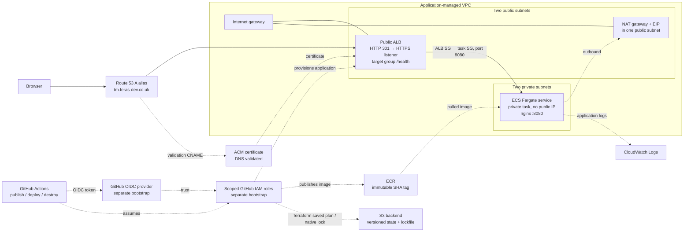

# ECS v1 final architecture

AWS account `670941257756`, region `eu-west-2`. Solid links show application traffic or resource use; dashed links show deployment/control relationships. The hosted zone, S3 backend and OIDC bootstrap have separate lifecycles from the application Terraform root.

The application Terraform root manages VPC, subnets/routes, NAT/EIP, ALB/listeners/target group, security groups, ECS resources, ECR, CloudWatch application logs, ACM and the application DNS records. The existing Route 53 hosted zone, S3 bucket/state history and separate GitHub OIDC/bootstrap infrastructure are retained across application destroy. One NAT gateway and one desired ECS task are configured; the two-subnet layout alone does not make the service fully redundant.
